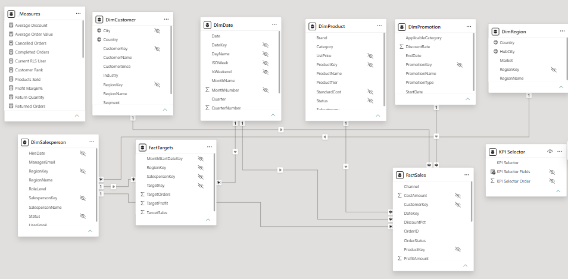
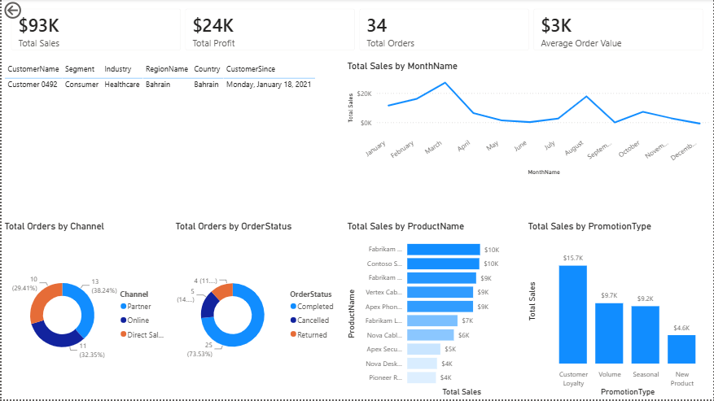
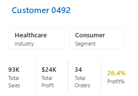
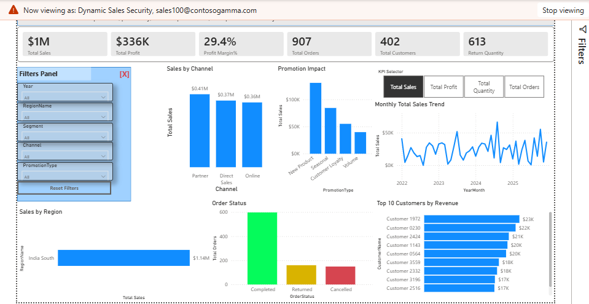

# Enterprise Sales Analytics Dashboard | Power BI

## Project Files

- [Download the Power BI Dashboard](Dashboard/Enterprise_Sales_Analytics.pbix)
- [View the Dataset](Dataset/FactSales.csv)

## Project Overview

This project demonstrates the design and implementation of an enterprise Power BI solution for **Contoso Global Distribution**, a fictional multinational distribution company.

The objective was to develop a secure, interactive, and high-performance reporting solution that enables executives, regional managers, and sales representatives to monitor business performance while maintaining role-based data security.

The solution was built using enterprise BI best practices, including star schema modeling, reusable DAX measures, Row-Level Security (RLS), drill-through analysis, report tooltips, bookmarks, and performance optimization.

## Business Problem

Contoso Global Distribution required a centralized reporting platform to replace static reports and fragmented analysis.

The business faced the following challenges:

- Limited visibility into regional sales performance
- Difficulty identifying underperforming products and customers
- Lack of interactive reporting for executives
- A requirement for secure access so users only view data relevant to their role
- A need for scalable reporting capable of supporting future business growth

## Business Objectives

- Create a single source of truth for sales analytics
- Provide interactive reporting for executives and managers
- Support customer, product, promotion, and regional analysis
- Secure data using Dynamic Row-Level Security
- Optimize report performance and user experience

## Dataset and Data Model

The solution follows a **star schema** consisting of:

### Fact Tables

- `FactSales`
- `FactTargets`

### Dimension Tables

- `DimDate`
- `DimCustomer`
- `DimProduct`
- `DimSalesperson`
- `DimPromotion`
- `DimRegion`

Relationships were designed using one-to-many, single-direction filtering to improve scalability and avoid ambiguous filter paths.

## Dashboard Overview

### Executive Dashboard

The executive dashboard provides:

- Sales KPIs
- Profitability analysis
- Regional performance
- Promotion effectiveness
- Customer analysis
- Channel performance
- Order-status monitoring

### Customer Drillthrough

The drill-through page allows users to navigate from summary visuals to detailed customer profiles.

### Customer Tooltip

The report tooltip provides contextual customer information without requiring users to navigate away from the current report page.

### Dynamic Row-Level Security

Dynamic Row-Level Security uses `USERPRINCIPALNAME()` to ensure users can access only the data relevant to their responsibilities.

## KPIs

### Executive KPIs

- Total Sales
- Total Profit
- Profit Margin %
- Total Orders
- Total Customers

### Customer KPIs

- Customer Revenue
- Customer Profit
- Customer Rank

### Sales KPIs

- Target Achievement %
- Return Quantity

## Technologies Used

- Microsoft Power BI Desktop
- Power Query
- DAX
- CSV data sources
- Power BI Service concepts

## Advanced Power BI Features

- Star schema
- Model validation
- Display folders
- Field parameters
- Dynamic measure selection
- Dynamic titles
- Drill-through
- Report tooltips
- Dynamic Row-Level Security
- Performance Analyzer
- Bookmarks and navigation

## Business Value

The solution provides:

- A single source of truth for enterprise sales reporting
- Faster executive decision-making
- Secure access for different business roles
- Interactive analytics that replace static reports
- Improved report usability through drill-through, tooltips, and bookmarks

## Challenges and Solutions

| Challenge | Solution |
| --- | --- |
| **Ambiguous relationship between Region and FactSales** | Initially, creating a direct relationship between `FactSales` and `DimRegion` caused an ambiguous filter path because Region was already related through `DimSalesperson`. The model was redesigned to use a single active relationship via `DimSalesperson`, ensuring predictable filter propagation and maintaining a clean star schema. |
| **Dynamic KPI trend analysis** | Instead of creating separate trend charts for Sales, Profit, Orders, and Quantity, field parameters were implemented to allow users to switch KPIs dynamically within a single visual. This improved usability and reduced dashboard clutter. |
| **Implementing secure access for different users** | Dynamic Row-Level Security was implemented using `USERPRINCIPALNAME()`, allowing each salesperson to view only their own data while maintaining a single reusable report. |
| **Providing detailed analysis without overcrowding the dashboard** | Drill-through pages and report tooltips were introduced so users could access customer-level details and contextual information without increasing dashboard complexity. |
| **Optimizing report performance and usability** | Performance Analyzer was used to evaluate report performance. Auto Date/Time was disabled, unnecessary columns were removed or hidden, report interactions were optimized, and a dedicated Date dimension was used to improve performance and maintainability. |
| **Managing a growing number of DAX measures** | A dedicated measure table with display folders was created to organize reusable DAX measures into logical groups such as Executive KPIs, Customer KPIs, Sales KPIs, and Product KPIs. |

## My Role

I independently completed the following activities:

- Business requirements analysis
- Data profiling
- Power Query transformations
- Star schema design
- DAX development
- Dashboard design
- KPI validation
- Documentation

## Lessons Learned

This project strengthened my understanding of enterprise sales analytics, security, and scalable Power BI solution design.

Key learnings include:

- Designing a multi-fact star schema for sales and target analysis
- Resolving ambiguous filter paths through deliberate relationship design
- Developing reusable, business-focused DAX measures
- Using field parameters for dynamic KPI selection
- Implementing user-based Dynamic Row-Level Security
- Applying drill-through pages, report tooltips, and bookmarks to improve navigation
- Using Performance Analyzer and model optimization techniques to improve report performance

## Limitations

- The dataset is simulated and does not represent real organizational data
- The solution uses imported data and does not include live or scheduled data refresh
- DirectQuery connectivity and composite models were not implemented
- Integration with enterprise data sources such as Azure SQL Database, Microsoft Fabric, ERP, or CRM systems is outside the scope of this project
- Mobile-optimized report layouts and multilingual support were not implemented
- Advanced enterprise governance features, such as deployment pipelines and automated monitoring, were covered conceptually but not implemented

## Future Enhancements

- Incremental refresh
- Deployment pipelines
- Azure SQL integration
- DirectQuery support
- AI forecasting
- Microsoft Fabric integration
